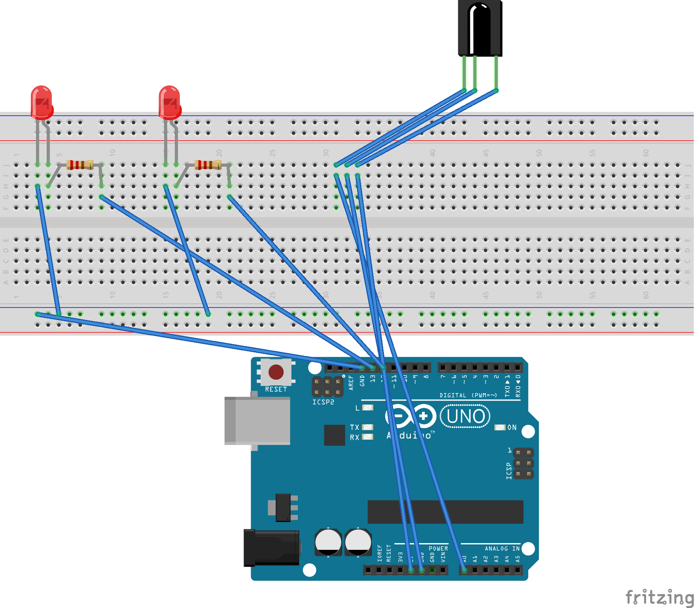
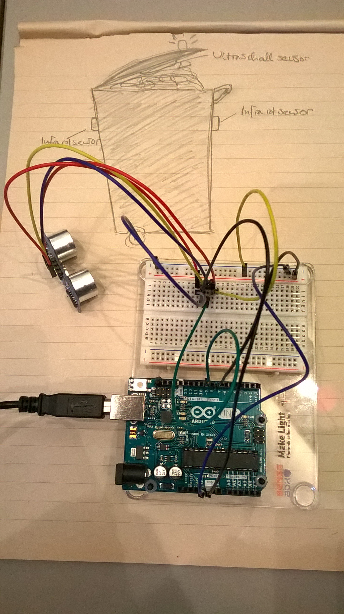
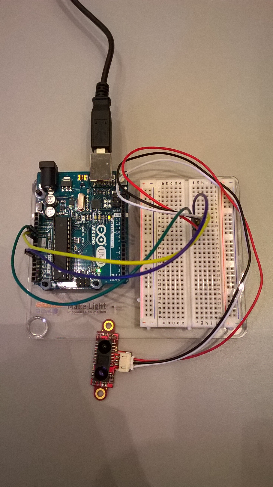
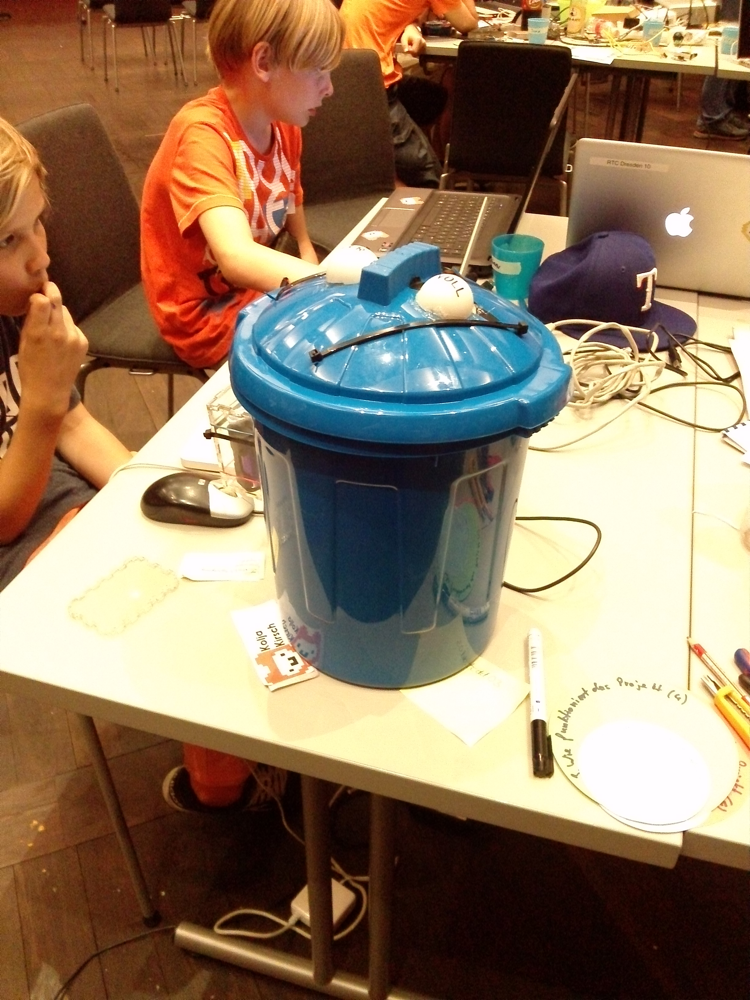
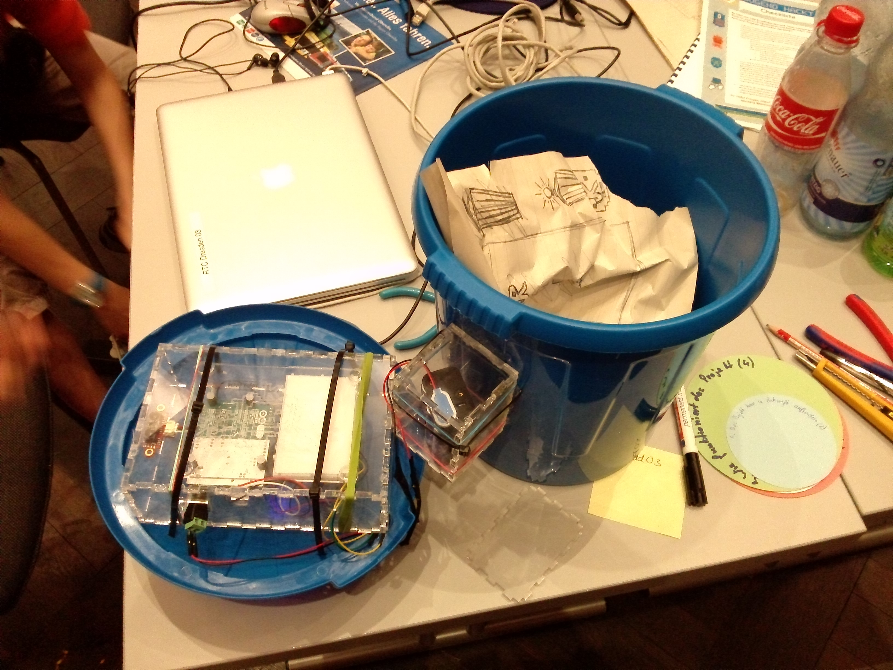

#README Die intelligente Mülltonne

Der Intelligente Mülleimer prüft, ob er voll ist, und schickt dann eine Meldung an die städtische Müllabfuhr und eine Lampe leuchtet Rot auf.

Hardware:

* Arduino
* Distanzsensor mit Infrarot
* Gehäuse aus dem Lasercutter

Gebaut von Julian, Kolja, Tigran und Paul

##Der Schaltplan:

##Alles begann mit einer Skizze:

Dann haben wir den Ultraschall-Sensor noch gegen einen
Infrarot-Entfernungssensor ausgetauscht.

##Mit Ultraschall Sensor:

##Mit Infrarot-Entfernungssensor:

##Das Modell:
Wir haben dann die Technik in Boxen gepackt und diese Boxen dann in unseren Mülleimer gepackt das ganze sah dann so:

und so:

aus.
